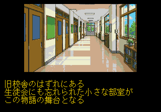
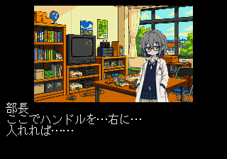
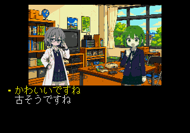
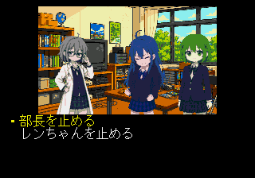

# 第1話のメガCD実行検証

Dockerを使わず、LinuxネイティブのGCC 13.3.0 / binutils 2.42でビルドした。
ユーザー提供の日本版メガCD BIOSと、固定コミットのGenesis Plus GXを使用した。
エミュレーターのコードは変更していない。実機では未検証。

## 全ルート

コントローラー入力だけでタイトルからエンディングへ進めた。
セーブステート、シナリオ位置の書き換え、BIOSを含むダンプは使用していない。
選択は上から1番目・2番目として以下の全4組み合わせを確認した。

| 1回目の選択 | 2回目の選択 | 通過した会話 | 結果 |
|---|---|---:|---|
| 1 | 1 | 254 | PASS |
| 1 | 2 | 257 | PASS |
| 2 | 1 | 256 | PASS |
| 2 | 2 | 259 | PASS |

合計で18シーン・275会話を網羅した。同じ会話を重複計上していない。
全ルートでMain CPUの進行、分岐変数、エンディング到達を確認し、
ゲームのエラーとPCMリングのアンダーランはいずれも0だった。
結果は [route-00](evidence/novel-ep01/route-00.json)、
[route-01](evidence/novel-ep01/route-01.json)、
[route-10](evidence/novel-ep01/route-10.json)、
[route-11](evidence/novel-ep01/route-11.json) に保存している。

## 音声

- タイトルの元CD-DA曲をステレオで再生し、実出力を録音した。
- 7.28秒の `voice_0002` を最後まで再生する間、BGMを同時に継続した。
- 台詞が終わった後もBGMの再生が続くことを確認した。
- 長い音声の連続復号はBGM 8 kHz＋台詞11.025 kHzへ設定した。
  16 kHzの長い台詞とBGMの組み合わせでは余裕が不足したため、
  復号・Wave RAM書き込みを最適化し、同時復号の受付上限も設けた。
- エンディングのCD-DAと、その後のロゴ画面への復帰を追加確認した。

音声の有無は「再生要求を出した」フラグだけでは判断していない。
録音したPCMの振幅と再生状態の両方を検査している。
台詞・BGM・CD-DAの変換方法と再生上限は [ノベル仕様](novel.md) を参照。

## 実行画面

## ビルド・データの検査

`make all host-test doctor` と `make novel` を実行した。
8件のホストテストで、元シナリオの会話・音声・分岐の保持、
パックの範囲と容量、日本語の改ページ、音声ヘッダーとCD-DAハッシュ、
既存のIMAゴールデンベクトル、ISOの実データ、生成の再現性を確認した。
参照元343ファイルを固定コミットのGit blob SHAと照合した。

既存のメディアサンプルも、画像、ADPCM、CD-DA、一時停止・再開、
同時再生、停止、画像再読み込みのすべてで再検証に合格した。
[メディア回帰テスト結果](evidence/novel-ep01/media-regression.json) を参照。

BIOSの全バイト列が追跡ファイルに含まれず、BIOSに一致するGitオブジェクトも
存在しないことを確認した。CIの成果物はディスクとログを個別に列挙しており、
BIOSやエミュレーターの保存状態は含めない。
