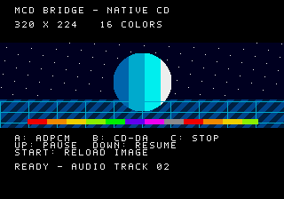

# 検証記録

## 初期検証

- ビルド: Linux x86_64、m68k-linux-gnu GCC 13.3.0 / binutils 2.42、`-m68000`。
- 基盤: Megadev v1.2.0、コミット`7a7246c14b845ad2f1bd3c7d73afb04cf67d83ef`。
- エミュレータ: 改変していないGenesis Plus GX libretro、コミット`a7985a9c4278ac352f8ca7bb4d3cc6b36e9e3e7d`。
- BIOS: ユーザー提供の日本版Mega CD 1。ローカル専用として使用。
- BIOS本体、セーブステート、BIOSを含むメモリダンプはGitにもCIにも保存していません。

| 検査 | 結果 |
|---|---|
| 日本版BIOSからCUEによるCD起動 | PASS |
| CDから320×224・16色の画像を読み込み・表示 | PASS（目視確認も実施） |
| 圧縮IMA ADPCMをCDからロードしSub CPUで展開 | PASS |
| PCM音源からADPCM音声を出力 | PASS（両ch RMS 約5458） |
| ADPCM約2秒再生後の無音 | PASS |
| CD-DAトラック2のステレオ音声出力 | PASS（左右ch RMS 約7777） |
| CD-DA一時停止・再開 | PASS（無音／音声の切り替わり） |
| CD-DA未再生時の一時停止・再開 | PASS（NOT_READY、画面更新継続） |
| 読み込み済みADPCMとCD-DAの同時出力 | PASS（440 Hz / 330 Hz / 550 Hzを同じ出力で検出） |
| 両方の音声停止 | PASS |
| CDから画像を再ロード | PASS |
| ADPCM再生中にMainフレームカウンタが進む | PASS |
| IMA既知ベクトル・飽和・PCMループ記号回避 | PASS |
| ISOディレクトリ・extent・ファイル内容 | PASS |
| CD-DAの音声形式・2秒プリギャップ | PASS |
| アセット再生成でSHA-256一致 | PASS |
| 存在しない画像ファイル | PASS（NOT_FOUND、画面更新継続） |
| 256 KiBを超える画像ファイルの申告サイズ | PASS（SIZEエラー、転送開始前に拒否） |
| ADPCMヘッダの不正なステップインデックス | PASS（FORMATエラー、画面更新継続） |

`tools/smoke.py`はコントローラ入力を送り、実際のエミュレータ画面・音声を取得して検査します。
テレメトリはサンプルが予約した24バイトのみ読みます。
起動・画面のソースコード検査だけを実行確認と扱っていません。



実行時の数値は[正常系JSON](evidence/emulator-report.json)と
[異常系JSON](evidence/error-report.json)に保存しています。
ディスクのSHA-256、サンプル専用テレメトリ、音声の測定結果を含みます。

Linuxの[クリーンCIビルド](https://github.com/HOSSIE-JP/dev_mcd/actions/runs/34049115223)も成功し、
コミット`a8d650d`のCIで生成したCUE / ISO / WAVをローカルへ取得して同じBIOSで再検証しました。
3ファイルはローカルビルドとバイト単位で一致しています。

実機での確認は未実施です。Windowsポータブル環境のクリーンセットアップはCIで検証し、
結果が得られ次第この記録を更新します。

## 再実行

```sh
make all host-test
python3 tools/deps.py --emulator
make -C .deps/genesis-plus-gx -f Makefile.libretro -j2
python3 tools/smoke.py --bios /path/to/your-japanese-bios.bin
python3 tools/error_smoke.py --bios /path/to/your-japanese-bios.bin
```

`build/validation/report.json`が集計、同じ場所のPNG / WAVがエミュレータ出力です。
BIOSは`.local/smoke/system/`にだけ配置します。検証出力は通常Git管理外です。

## 実機での確認項目

CUE / ISO / WAVを混在モードCDとして書き込み、日本版メガCDで起動し、
A/B/C・上/下・STARTの各操作を確認してください。CD-DAはデータトラックにWAVを
コピーする方式ではなく、トラック2として書き込む必要があります。
光学ドライブのシーク・読み取りエラー・連続動作と、異なるBIOSの挙動は今後の確認対象です。
